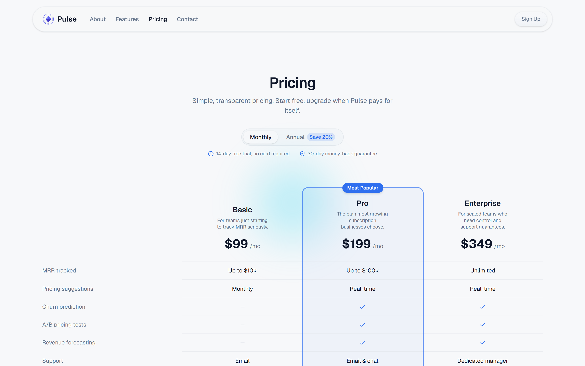
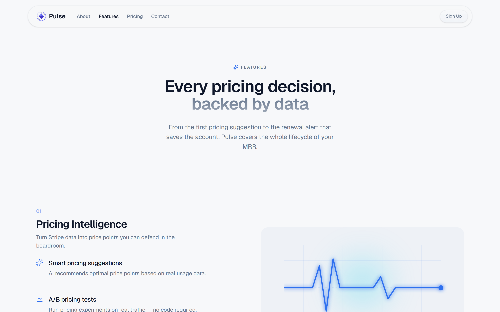

# Pulse — AI Revenue Copilot

### [→ Live demo](https://pulse-ai.lcp942.com)
> Fully static — no account, no setup, runs in the browser.

---


A fully static React showcase of polished, fluid front-end craftsmanship for SaaS-style products.
Pulse is a fictional "AI revenue copilot" — a landing page, a features page, a how-it-works
section, and a pricing page, culminating in a **simulated checkout built on real Stripe Elements**.
There is no backend, database, or authentication: the payment is a genuine-feeling visual moment
(a real Stripe card form with authentic validation and states) rather than a functional charge.
The pricing page is the centerpiece — the single screen most likely to be judged in isolation.

---

## Screenshots





---

## Stack

| Layer | Technology |
|---|---|
| Framework | React 19, TypeScript, Vite 8 |
| Styling | Tailwind CSS 4, Base UI, class-variance-authority, tailwind-merge |
| Animation | Motion (page transitions, scroll-linked reveals, hand-built SVG art) |
| Routing | React Router 8, route-level code splitting (every page lazy except the landing) |
| Payments | Stripe Elements (`@stripe/react-stripe-js`) — simulated checkout, no backend |
| Fonts / Icons | Geist & Geist Mono (self-hosted), lucide-react |
| Tests | Vitest + Testing Library (jsdom); Playwright for responsive audits |
| Lint | oxlint |
| Container | Multi-stage Docker build → nginx (static, SPA fallback) |

---

## Quick start

**Prerequisites:** Node.js 24.

```bash
npm install
npm run dev
```

Open [http://localhost:5173](http://localhost:5173) — the app runs with zero configuration.

### Docker (production build)

Serves the static build through nginx with SPA fallback and immutable asset caching.

```bash
docker build -t pulse-ai:prod .
docker run -d -p 8099:80 pulse-ai:prod
```

Then open [http://localhost:8099](http://localhost:8099).

---

## Configuration

The app runs with **no required environment variables**. The checkout falls back to Stripe's
well-known public test key, so Stripe Elements works out of the box.

| Variable | Required | Description |
|---|---|---|
| `VITE_STRIPE_PUBLISHABLE_KEY` | no | Your own Stripe **publishable** key (safe for the client). Baked in at build time — pass it as a build arg for Docker: `docker build --build-arg VITE_STRIPE_PUBLISHABLE_KEY=pk_… -t pulse-ai:prod .` |

---

## Scripts

| Command | Description |
|---|---|
| `npm run dev` | Start the Vite dev server |
| `npm run build` | Type-check (`tsc -b`) and build to `dist/` |
| `npm run preview` | Preview the production build locally |
| `npm test` | Run the full test suite once (Vitest) |
| `npm run test:watch` | Vitest in watch mode |
| `npm run lint` | Lint with oxlint |
| `npm run screenshots` | Capture every route at 6 widths (Playwright responsive audit) |
| `npm run icons` | Regenerate favicons / PWA icons |

---

## Testing

```bash
npm test
```

Components and pages are covered with Vitest + Testing Library on jsdom, asserting behaviour
(rendered content, routing, form states) rather than implementation detail. CI
(`.github/workflows/ci.yml`) runs lint, build, and the test suite on every push and pull request.

---

## Deployment

The build output in `dist/` is a static SPA — deploy it to any static host (Vercel, Netlify,
Cloudflare Pages, S3/CloudFront, …). One requirement: a catch-all rewrite so every path serves
`index.html`, letting React Router resolve client-side routes on a full page load. Example for nginx:

```nginx
location / {
  try_files $uri $uri/ /index.html;
}
```

The included `Dockerfile` + `nginx.conf` already handle this, so any container host works as-is.

---

## License

MIT
